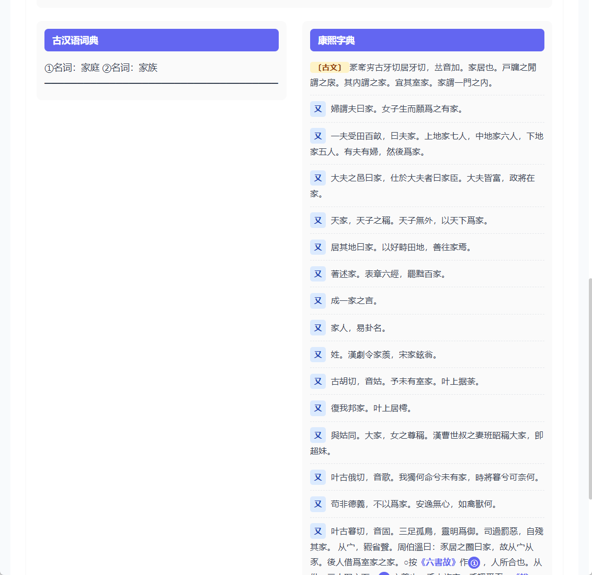

# 易译 🍑

> 古文/英语划词翻译助手 - 轻量、离线、AI增强

## 📸 应用截图

<div align="center">
  
  
  
  
</div>

## ✨ 功能特性

### 🎯 核心功能

- **📋 复制即翻译** - 复制文字后自动翻译，无需额外操作
  - 选中任意文字 → Ctrl+C 复制 → 自动显示翻译结果
  - 结果直接显示在主窗口，方便查看和操作
  - 支持中英文自动识别，智能切换翻译方向

- **📚 离线词库** - 内置多本词典，无网也能查词
  - 古汉语常用字字典
  - 古汉语词典
  - 康熙字典
  - 英汉词典
  - 中英词典

- **🤖 AI增强** - 联网时调用 DeepSeek 进行智能翻译
  - 整句翻译更准确
  - 支持古文白话对照

### 🎨 其他特性

- **⭐ 生词本** - 收藏生词，支持导出
- **📜 历史记录** - 查询历史随时查看
- **🎨 双主题** - 支持浅色/深色主题

## 📖 使用说明

### 复制自动翻译（推荐）

这是最便捷的翻译方式：

1. **选中文字** - 在任意应用中选中要翻译的文字
2. **复制** - 按 `Ctrl+C` 复制
3. **自动翻译** - 易译自动识别并翻译，结果直接显示在主窗口

> 💡 **提示**：支持中英文自动识别，无需手动选择语言

### 手动输入翻译

1. 打开易译主窗口
2. 在输入框中输入要翻译的文字
3. 按 `Enter` 或点击"翻译"按钮

### 配置 AI 翻译

1. 打开设置面板
2. 输入 [DeepSeek API Key](https://platform.deepseek.com/)
3. 点击保存

配置后，本地词库查不到的内容会自动调用 AI 翻译。

## 📦 安装

### Windows

1. 从 [Releases](https://github.com/HumSunTT/yiyi-dictionary/releases) 下载最新版本的安装包
2. 双击 `YiYi_0.1.0_x64-setup.exe` 安装
3. 安装完成后替换完整数据库（见下方说明）

### 替换完整数据库

安装包内置示例数据库（仅15个词汇），完整数据库需要手动替换：

1. 从 [Releases](https://github.com/HumSunTT/yiyi-dictionary/releases) 下载 `yi_yi_db.zip`
2. 解压得到 `yi_yi.db` 文件
3. 关闭易译应用
4. 将数据库文件复制到：
   - **Windows**: `C:\Users\{用户名}\AppData\Roaming\com.yi-yi.translate\yi_yi.db`
5. 重启应用

完整数据库包含：
- 古汉语词典：52,783 条
- 英汉词典：768,763 条
- 中英词典：112,626 条

### 从源码构建

```bash
# 克隆项目
git clone https://github.com/HumSunTT/yiyi-dictionary.git
cd yiyi-dictionary

# 安装依赖
npm install

# 开发模式运行
npm run tauri dev

# 构建生产版本
npm run tauri build
```

## 🔧 技术栈

| 层级 | 技术 |
|------|------|
| 桌面框架 | Tauri 2.0 |
| 前端 | Vue 3 + TypeScript |
| UI | Naive UI |
| 状态管理 | Pinia |
| 本地数据库 | SQLite |
| AI 翻译 | DeepSeek API |

## 📝 翻译结果展示

### 输入英文（如 home）

- **英汉词典**：显示词性、释义、例句
- **古汉语词典**：自动提取中文释义中的词汇，查询对应古汉语
- **相关短语**：显示包含该单词的常用短语

### 输入中文

- **中英词典**：显示英文翻译
- **古汉语词典**：显示该字的古汉语释义、例句
- **康熙字典**：显示康熙字典详细解释

## 🤝 贡献

欢迎贡献代码、词库数据或建议！

1. Fork 本仓库
2. 创建功能分支 (`git checkout -b feature/amazing-feature`)
3. 提交更改 (`git commit -m 'Add amazing feature'`)
4. 推送到分支 (`git push origin feature/amazing-feature`)
5. 创建 Pull Request

## 📄 许可证

[MIT License](LICENSE)

## 🙏 致谢

- [Tauri](https://tauri.app/) - 轻量级桌面应用框架
- [Naive UI](https://www.naiveui.com/) - Vue 3 UI 组件库
- [DeepSeek](https://deepseek.com/) - AI 翻译服务

---

🍑 **易译** - 让古文阅读更轻松